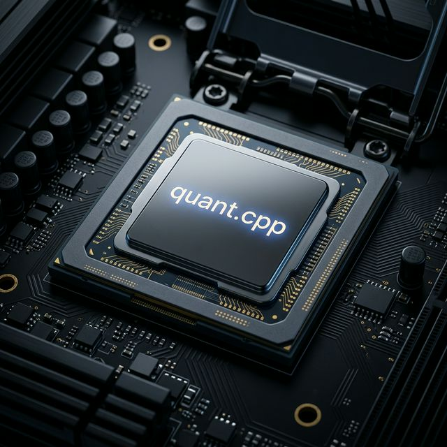

# quant.cpp



로컬 LLM을 위한 미니멀 C 추론 엔진. [**quant.h**](#단일-헤더-모드) 단일 헤더로도 제공됩니다.

33K LOC. 외부 라이브러리 없음. 오후 한나절이면 전체 코드를 읽을 수 있습니다.

[]()
[]()
[]()

---

## 같은 하드웨어에서 ~4배 긴 컨텍스트

KV 캐시 압축으로 토큰당 메모리를 3.8배 줄여, 컨텍스트를 그만큼 확장합니다.

| 하드웨어 | 모델 | FP16 KV | 4-bit K + Q4 V | 배율 |
|----------|------|---------|----------------|------|
| 8GB 노트북 | Llama 8B (Q4) | ~16K 토큰 | ~61K 토큰 | 3.8x |
| 16GB Mac Air | SmolLM2 1.7B | ~78K 토큰 | ~298K 토큰 | 3.8x |
| 24GB RTX 3090 | Llama 8B (Q4) | ~147K 토큰 | ~559K 토큰 | 3.8x |

*KV 메모리 절감 기반 추정치. 실제 컨텍스트는 모델 가중치 이후 가용 메모리에 따라 다릅니다.*

```bash
./quant model.gguf -p "hello"
```

---

## 왜 quant.cpp인가

|  | quant.cpp | llama.cpp |
|--|-----------|-----------|
| 코드 | **33K LOC**, Pure C | 250K+ LOC, C++ |
| 설계 | 읽고, 수정하고, 임베딩 | 기능 완성도 |
| 의존성 | libc + pthreads only | ggml 프레임워크 |
| KV 압축 | 4-bit: PPL **+0.0%**, 3-bit: +1.3% | PPL +10.6% |

quant.cpp는 포크가 아닙니다. 처음부터 새로 만든 독립 엔진입니다. 목표: **이해하고, 커스터마이즈하고, 내 제품에 넣을 수 있는 LLM 추론.**

- **Read** — 33K줄. 전체 forward pass가 하나의 파일에 들어갑니다.
- **Modify** — Pure C11, 모듈러. 양자화 타입 추가, 어텐션 커널 교체, 샘플링 전략 변경.
- **Embed** — 프레임워크 없음, 패키지 매니저 없음. 소스를 복사하면 어디서든 컴파일.

---

## 단일 헤더 모드

파일 1개 복사. 어떤 C 프로젝트에든 LLM 추가.

```c
#define QUANT_IMPLEMENTATION
#include "quant.h"
#include <stdio.h>

static void on_token(const char* text, void* ud) {
    (void)ud;
    printf("%s", text);
    fflush(stdout);
}

int main() {
    quant_model* m = quant_load("model.gguf");
    quant_ctx*   c = quant_new(m, NULL);
    quant_generate(c, "Hello!", on_token, NULL);
    quant_free_ctx(c);
    quant_free_model(m);
}
```

```bash
cc app.c -o app -lm -lpthread    # 끝
```

15K줄, 628KB. cmake 없음, 빌드 시스템 없음, 프레임워크 없음.

**전체 API** (6개 함수):

| 함수 | 설명 |
|------|------|
| `quant_load(path)` | GGUF 모델 파일 로드 |
| `quant_new(model, config)` | 추론 컨텍스트 생성 (config=NULL이면 기본값) |
| `quant_generate(ctx, prompt, callback, userdata)` | 콜백으로 토큰 스트리밍 |
| `quant_ask(ctx, prompt)` | 전체 응답 문자열 반환 (호출자가 free) |
| `quant_free_ctx(ctx)` | 컨텍스트 해제 |
| `quant_free_model(model)` | 모델 해제 |

**설정 옵션:**

```c
quant_config cfg = {
    .temperature = 0.7f,    // 샘플링 온도
    .top_p       = 0.9f,    // nucleus 샘플링
    .max_tokens  = 256,     // 최대 생성 토큰 수
    .n_threads   = 4,       // matmul 스레드 수
    .kv_compress = 1,       // 0=끔, 1=4-bit K+V, 2=delta+3-bit
};
quant_ctx* c = quant_new(model, &cfg);
```

---

## 빠른 시작 (Full Build)

```bash
git clone https://github.com/quantumaikr/quant.cpp && cd quant.cpp
cmake -B build -DCMAKE_BUILD_TYPE=Release
cmake --build build -j$(nproc)

# 추론 실행
./build/quant model.gguf -p "hello"

# KV 압축 (4-bit K + Q4 V, 3.8x, 추천)
./build/quant model.gguf -p "hello" -k uniform_4b -v q4

# Delta 압축 (3-bit K + Q4 V, 4.3x, 최대 압축)
./build/quant model.gguf -p "hello" -k uniform_3b -v q4 --delta

# PPL 측정
./build/quant model.gguf --ppl input.txt -k uniform_4b -v q4

# JSON 출력 (CI 연동용)
./build/quant model.gguf --ppl input.txt -k uniform_4b --json

# 버전 확인
./build/quant --version
```

---

## KV 캐시 압축

### 압축 모드

| 구성 | 압축률 | PPL vs FP32 (WikiText-2) | 용도 |
|------|--------|--------------------------|------|
| delta + 3b K + Q4 V | ~4.3x | **+1.3%** | 최대 컨텍스트 |
| delta + 4b K + Q4 V | ~3.8x | ~0% | 최고 품질 |
| uniform 4b K + Q4 V | 3.8x | -0.4% | 심플, delta 오버헤드 없음 |
| uniform 4b K + FP16 V | 1.6x | +0.0% | 무손실 |

### Delta 압축 원리

표준 KV 캐시는 각 key를 그대로 저장합니다. Delta 모드는 `key[t] - reconstruct(key[t-1])`을 저장합니다 — 비디오 P-frame처럼.

트랜스포머의 인접 key는 절대값 범위의 ~30%만 차이납니다. 이 작은 범위 덕분에 3-bit 양자화가 가능합니다. Delta 없이 3-bit는 PPL +62%. Delta와 함께라면 **+1.3%**.

64 토큰마다 FP32 I-frame을 저장하여 드리프트를 방지합니다.

### WikiText-2 PPL (SmolLM2 1.7B, 표준 벤치마크)

| 구성 | PPL | vs FP32 |
|------|-----|---------|
| FP32 baseline | 14.63 | -- |
| uniform 4b K + FP16 V | 14.63 | **+0.00%** |
| uniform 4b K + Q4 V | 14.57 | -0.4% |
| delta + 3b K + Q4 V | 14.82 | +1.3% |
| uniform 3b (no delta) | — | +62% |

모델별 검증 (4b K + Q4 V): SmolLM2 1.7B (-1.6%), Qwen3.5 0.8B (+0.9%), Qwen3.5 4B (+0.6%).

---

## 지원 모델

| 모델 | 아키텍처 | 파라미터 | 상태 |
|------|----------|----------|------|
| SmolLM2-1.7B | Llama | 1.7B | PPL 검증 |
| Qwen3.5-0.8B | Qwen3.5 (DeltaNet) | 752M | PPL 검증 |
| Qwen3.5-4B | Qwen3.5 (DeltaNet) | 4B | PPL 검증 |
| Qwen3.5-35B-A3B | Qwen2-MoE | 35B (3B active) | 동작 |
| Gemma 3 270M | Gemma 3 | 270M | 동작 |
| **Gemma 4 26B-A4B-it** | **Gemma 4 MoE** | **26B (4B active)** | **검증 완료** |

### Gemma 4 26B-A4B (NEW)

Gemma 4의 하이브리드 MoE 아키텍처를 완전 지원합니다:

- **Dual-FFN**: Dense MLP + 128-expert MoE 병렬 실행 (레이어당)
- **하이브리드 어텐션**: 25 sliding (head_dim=256) + 5 full (head_dim=512) 레이어
- **QK-norm 인식 KV 압축**: K는 FP32 자동 유지, V만 Q4 양자화 (3.5x 절약)
- **IQ3_XXS/IQ4_NL** NEON 최적화 fused dot (MoE expert 가속)
- **GeGLU** 활성화 (NEON fast tanh 근사)

```bash
# Gemma 4 26B 추론 + KV 압축
./build/quant gemma-4-26B-A4B-it-UD-Q3_K_M.gguf \
  -p "<start_of_turn>user\n대한민국의 수도는?\n<end_of_turn>\n<start_of_turn>model\n" \
  -n 50 -j 8 -T 0.0 -k uniform_4b -v q4
# 출력: "대한민국의 수도는 **서울**입니다."
```

아키텍처: Llama/Qwen3.5 (공유 경로), Gemma 3/4 (sliding + full attention), Qwen2-MoE, Gemma 4 MoE (dual-FFN + 하이브리드 어텐션).

GGUF 포맷. llama.cpp 호환 모델 파일을 그대로 사용합니다.

---

## 백엔드

| 백엔드 | 플랫폼 | 상태 |
|--------|--------|------|
| NEON | ARM CPU | Production |
| AVX2 | x86 CPU | Production |
| Metal | Apple Silicon | Verified |
| CUDA | NVIDIA GPU | Compiles |
| Vulkan | Cross-platform | Compiles |

---

## FAQ

**llama.cpp와 뭐가 다른가요?**

llama.cpp는 전체 기능을 갖춘 추론 프레임워크 (250K+ LOC). quant.cpp는 읽고, 수정하고, 내 프로젝트에 넣을 수 있는 미니멀 엔진 (33K LOC).

**llama.cpp/ollama에도 Q4 KV 양자화가 있는데, 뭐가 다른가요?**

둘 다 4-bit이지만 품질 차이가 큽니다. SmolLM2 1.7B 기준:
- llama.cpp Q4_0 KV: PPL **+10.6%** (눈에 띄는 저하)
- quant.cpp 4-bit K: PPL **+0.0%** (무손실)

차이점: llama.cpp는 K와 V에 같은 양자화를 적용합니다. quant.cpp는 K와 V를 각각 최적 방식으로 독립 양자화합니다. 추가로 quant.cpp만의 delta 압축이 있습니다 — 인접 key의 차이만 저장하여 3-bit까지 내리면서 PPL +1.3%만 상승. llama.cpp에는 이 기능이 없습니다.

**내 앱에 임베딩할 수 있나요?**

네. 두 가지 방법:
1. **단일 헤더** (가장 간편): `quant.h`를 프로젝트에 복사. `.c` 파일 하나에 `#define QUANT_IMPLEMENTATION`. 끝.
2. **전체 라이브러리**: `libturboquant.a`에 링크하고 `tq_load_model()` / `tq_generate()` 호출.

Linux, macOS, Windows, iOS, Android, WASM에서 동작합니다.

**quant.h와 Full Build의 차이는?**

`quant.h`는 핵심 추론 엔진 (15K LOC)을 단일 파일에 담은 것. Full Build (33K LOC)에는 GPU 백엔드 (Metal, CUDA, Vulkan), MoE 라우팅, 고급 양자화 타입, CLI 도구, 벤치마크가 추가됩니다. 임베딩에는 quant.h, 연구/개발에는 Full Build.

**15K줄 헤더 — 너무 크지 않나요?**

stb_image.h는 7.8K줄. sqlite3.c (amalgamation)는 240K줄. quant.h는 그 사이 15K — 헤더로는 크고, 추론 엔진으로는 작습니다. 컴파일 시간은 Apple M3에서 ~1.7초. 바이너리 254KB. 컴파일 시간이 신경 쓰이면 CMake Full Build를 사용하고 `libturboquant.a`에 링크하세요.

**Karpathy의 llm.c와 비교하면?**

비슷한 철학: 미니멀 C, 교육적, 의존성 없음. 핵심 차이: quant.h는 양자화 가중치 (Q4_K_M, Q8_0, IQ2)와 다중 아키텍처 (Llama, Qwen, Gemma)를 GGUF 로더로 지원합니다. llm.c는 단일 모델 + FP32 가중치. quant.h에는 KV 캐시 압축도 포함. llm.c가 교과서라면 quant.h는 같은 아이디어의 프로덕션 버전.

**GPU 없으면 쓸모없는 거 아닌가요?**

용도에 따라 다릅니다. 대형 모델에서 100+ tok/s가 필요하면 llama.cpp + Metal/CUDA를 쓰세요. iOS 앱, WASM 모듈, 게임 엔진, GPU API가 없는 IoT 디바이스에 추론을 임베딩해야 하면 — quant.h가 적합합니다. Apple Silicon CPU에서 1.7B 모델 기준 25 tok/s, 어시스턴트나 자동완성, 백그라운드 처리에 충분합니다.

**Windows에서 동작하나요?**

네. `#ifdef _WIN32` 가드로 mmap (`CreateFileMapping`/`MapViewOfFile`), 스레딩, 파일 I/O를 처리합니다. MSVC 또는 MinGW로 컴파일: `cl app.c /O2` 또는 `gcc app.c -o app -lm -lpthread`.

**GGUF 모델 파일은 어디서 받나요?**

[Hugging Face](https://huggingface.co/models?library=gguf)에서 아무 GGUF나 다운로드. 추천 입문 모델: [SmolLM2-1.7B-Instruct-Q8_0](https://huggingface.co/bartowski/SmolLM2-1.7B-Instruct-GGUF) (1.8GB). 변환 필요 없음 — GGUF 파일을 바로 사용합니다.

**AI가 만든 코드인가요?**

Claude Code를 AI 개발 도구로 사용하여 개발했습니다 (Copilot 사용과 동일). 아키텍처 결정, 알고리즘 선택, 버그 수정, 모든 PPL 측정은 사람이 주도하고 검증합니다. 33K줄의 C 코드 — 직접 읽어보시면 됩니다.

**3-bit 이하는요?**

광범위하게 테스트했습니다: 2-bit delta, sub-block scaling, multi-hash, error feedback, NF2, online SVD. 어떤 접근도 허용 가능한 품질을 달성하지 못했습니다. 근본 장벽: step당 코사인 0.997이 200 step 후 0.885로 누적. 3-bit + delta가 실용적 최소.

**브라우저(WASM)에서 돌아가나요?**

코드가 순수 C11이고 코어 경로에 플랫폼 의존성이 없습니다. Emscripten 컴파일을 지원합니다. 소형 모델로 브라우저 데모를 준비 중입니다.

---

## 참고 논문

- [TurboQuant](https://arxiv.org/abs/2504.19874) (ICLR 2026) — KV 캐시 압축 이론
- [QJL](https://arxiv.org/abs/2406.03482) (AAAI 2025) — 양자화 JL 변환
- [PolarQuant](https://arxiv.org/abs/2502.02617) (AISTATS 2026) — 극좌표 양자화

---

**[QuantumAI](https://quantumai.kr)** | [GitHub](https://github.com/quantumaikr/quant.cpp)

[](https://star-history.com/#quantumaikr/quant.cpp&Date)
